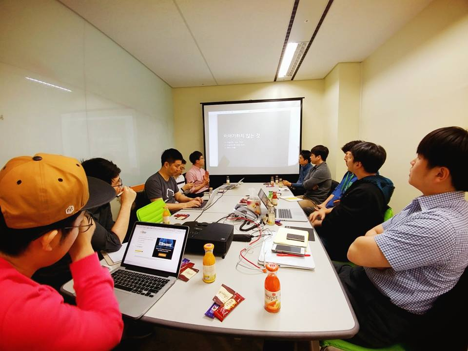

# AWS 유저그룹 소모임

## 강남 지역 모임

### 강남 초급자 모임
 - 2016년 12월 7일
   - [billing alarm 설정 및 계정 보안 설정 - 곽규복](https://goo.gl/FdGbtZ)
   
 - 2017년 1월 11일 
   - [AWS API 및 컴포넌트 소개 - 신상재](https://goo.gl/cp50KX)
   - [s3 와 cloudfrount 이용한 정적인 자원 관리 및 배포 - 김석영](https://goo.gl/mal5Uf)
   - [AWS 계정을 만들고 가장 먼저 해야 할 일 들과 하지 말아야 할 일 들- 정도현](http://www.awskr.org/2017/01/your-aws-first-days-todo-list/)

### 강남 중급자 모임

### 강남 SE 모임

### 강남 자격증 취득 준비모임 

## 판교 지역 모임

### 판교 초급자 모임

### 판교 중급자 모임

- 2017년 1월 6일
  - [AWS Cognito Federation Identity의 사용법과 역할 - 박진언](https://jinunpark.github.io/awskrug_20170106_introduction_to_aws_cognito)
  - [클라우드에서의 보안 - 정도현](http://www.slideshare.net/AmazonWebServices/intro-to-aws-security-50364629)
  - [AWS re:invent 2016 후기 - 정창훈](http://www.slideshare.net/seapy/aws-reinvent-2016)
  - [OpenSSL에 얽힌 비화](https://coolspeed.wordpress.com/2015/02/16/unseeable_comrade_in_arms/)
  - 

